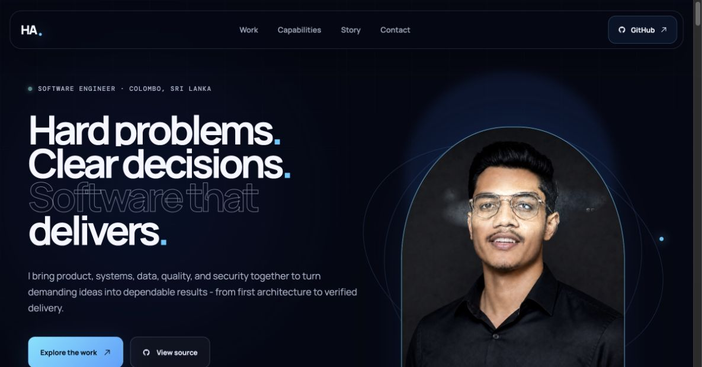

<div align="center">
  
  <h1>Himath Ahangama · Engineering Portfolio</h1>
  <p><strong>A motion-rich, evidence-led portfolio for a full-spectrum software engineer.</strong></p>
  <p>
    <a href="https://himath2002.github.io/">Live portfolio</a>
    ·
    <a href="https://github.com/Himath2002">GitHub profile</a>
  </p>
</div>



## The idea

This site presents software engineering as one connected discipline rather than a catalogue of tools. Product thinking, application development, systems, data, quality, debugging, and security are shown through concrete engineering work and verifiable outcomes.

EduGuard leads the portfolio as the flagship platform. The remaining case studies demonstrate range across Android, concurrent Java, extensible architecture, algorithms, distributed .NET, databases, simulation, and low-level C.

## Experience design

- Original dark blue and black visual system with responsive typography
- Cinematic entrance sequence, pointer depth, magnetic controls, responsive hover lighting, scroll reveals, marquee motion, and orbital effects
- Motion preferences respected through `prefers-reduced-motion`
- Keyboard-accessible navigation, visible focus flow, semantic sections, and descriptive image text
- Responsive layouts designed for large screens, tablets, and narrow mobile viewports
- No analytics, tracking, login wall, or hosted-service dependency

## Verified information

The portfolio states only supplied or repository-backed facts:

- 80.63 Course Weighted Average
- Dean's List for four consecutive study periods
- Software Engineering graduate from Curtin University with Distinction
- Educational foundation at Nalanda College, Colombo
- Direct links to public source repositories

## Local development

Requirements: Node.js 22.13 or newer and npm.

```bash
git clone git@github.com:Himath2002/Himath2002.github.io.git
cd Himath2002.github.io
npm ci
npm run dev
```

Open the local URL printed by Vite. Before publishing a change, run:

```bash
npm run check
npm audit --omit=dev --audit-level=high
```

## Project structure

```text
.
├── .github/workflows/deploy.yml   # verified GitHub Pages delivery
├── public/
│   ├── assets/                    # portrait and project visuals
│   └── mark.svg                   # portfolio monogram
├── src/
│   ├── App.tsx                    # content, interactions, and semantics
│   ├── main.tsx                   # React entry point
│   └── styles.css                 # design system, motion, and responsive rules
├── index.html                     # metadata and social-sharing surface
└── vite.config.ts                 # static production build
```

## Deployment

Every push to `main` runs a clean install, production dependency audit, TypeScript verification, and optimized Vite build. Only a successful build is uploaded through GitHub's official Pages artifact and deployment actions.

The resulting site is served directly from:

**[https://himath2002.github.io/](https://himath2002.github.io/)**

## Asset notice

The portrait and project artwork in `public/assets/` are personal portfolio assets and are not covered by the source-code license. The application source is available under the [MIT License](LICENSE).
